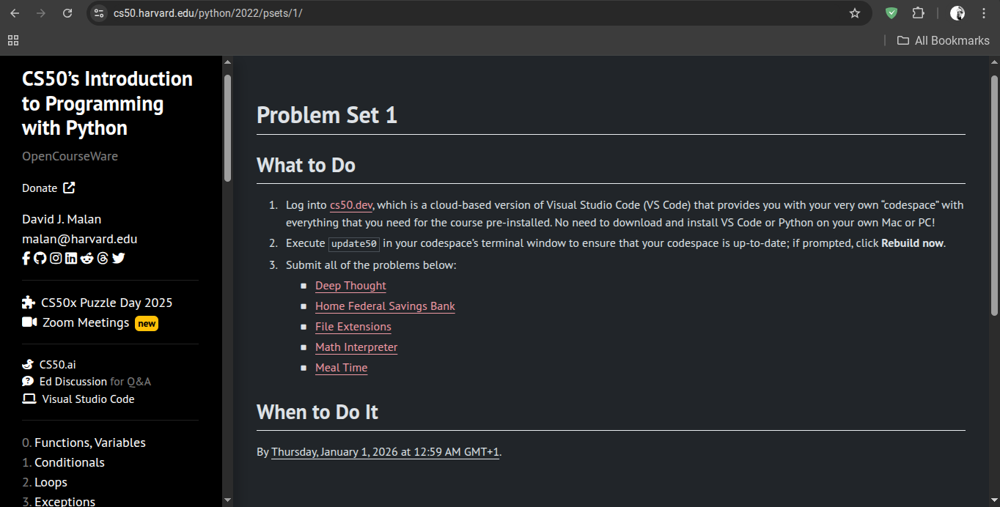

# **DAY 07 - 20/05/2025**

# **CS50P: Introduction To Programming with Python**

# PSET 1

LINK: [https://cs50.harvard.edu/python/2022/psets/1/](https://cs50.harvard.edu/python/2022/psets/1/)
 
 ---

## Table of Contents
1. [Deep Thought](#1-deep-thought)
2. [Home Federal Saving Bank](#2-home-federal-savings-bank)

---

## 1. Deep Thought
link: [https://cs50.harvard.edu/python/2022/psets/1/deep/](https://cs50.harvard.edu/python/2022/psets/1/deep/)

In deep.py, implement a program that prompts the user for the answer to the Great Question of Life, the Universe and Everything, outputting Yes if the user inputs 42 or (case-insensitively) forty-two or forty two. Otherwise output No.

Hints:
 - No need to convert the user’s input to an int if you check for equality with "42", a str, rather than 42, an int!
 - It’s okay if your output or the user’s wraps onto multiple lines.

## 2. Home Federal Savings Bank
link: [https://cs50.harvard.edu/python/2022/psets/1/bank/](https://cs50.harvard.edu/python/2022/psets/1/bank/)

In a file called bank.py, implement a program that prompts the user for a greeting. If the greeting starts with “hello”, output $0. If the greeting starts with an “h” (but not “hello”), output $20. Otherwise, output $100. Ignore any leading whitespace in the user’s greeting, and treat the user’s greeting case-insensitively.

Hints:
 - Recall that a str comes with quite a few methods, per [docs.python.org/3/library/stdtypes.html#string-methods](docs.python.org/3/library/stdtypes.html#string-methods).
 - Be sure to give $0 not only for “hello” but also “hello there”, “hello, Newman”, and the like.

---