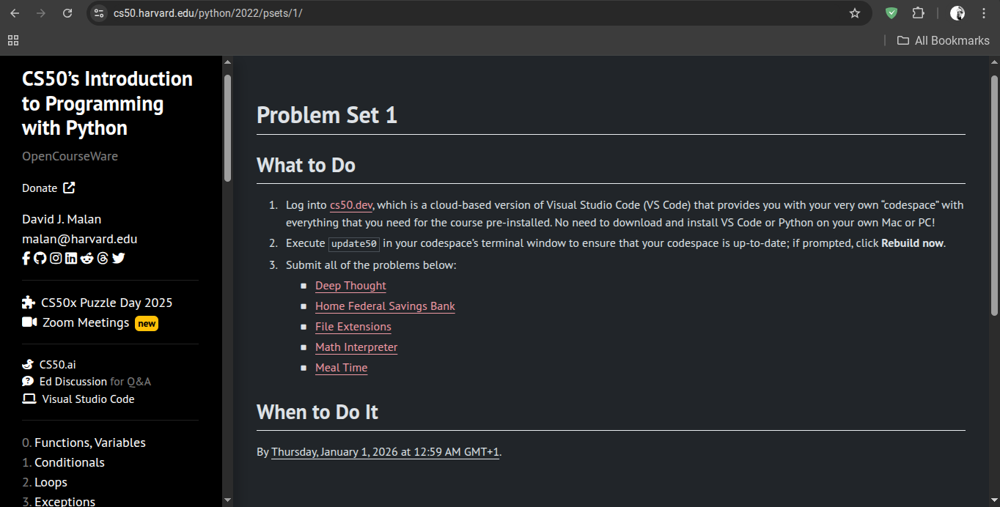

# **DAY 08 - 20/05/2025**

# **CS50P: Introduction To Programming with Python**

# PSET 1

LINK: [https://cs50.harvard.edu/python/2022/psets/1/](https://cs50.harvard.edu/python/2022/psets/1/)
 
 ---

## Table of Contents
1. [Deep Thought](#1-deep-thought)
2. [Home Federal Saving Bank](#2-home-federal-savings-bank)

---

## 1. File Extensions
link: [https://cs50.harvard.edu/python/2022/psets/1/extensions/](https://cs50.harvard.edu/python/2022/psets/1/extensions/)

In a file called extensions.py, implement a program that prompts the user for the name of a file and then outputs that file’s media type if the file’s name ends, case-insensitively, in any of these suffixes:

 - .gif
 - .jpg
 - .jpeg
 - .png
 - .pdf
 - .txt
 - .zip
 
If the file’s name ends with some other suffix or has no suffix at all, output application/octet-stream instead, which is a common default.

Hints
 - Recall that a str comes with quite a few methods, per [docs.python.org/3/library/stdtypes.html#string-methods](docs.python.org/3/library/stdtypes.html#string-methods).

## 2. Math Interpreter
link: [https://cs50.harvard.edu/python/2022/psets/1/interpreter/](https://cs50.harvard.edu/python/2022/psets/1/interpreter/)

In a file called **interpreter.py**, implement a program that prompts the user for an arithmetic expression and then calculates and outputs the result as a floating-point value formatted to one decimal place. Assume that the user’s input will be formatted as **x y z**, with one space between **x** and **y** and one space between **y** and **z**, wherein:

 - **x** is an integer
 - **y** is +, -, *, or /
 - **z** is an integer
For instance, if the user inputs **1 + 1**, your program should output 2.0. Assume that, if y is /, then z will not be 0.

Note that, just as python itself is an interpreter for Python, so will your interpreter.py be an interpreter for math!

Hints:
 - Recall that a **str** comes with quite a few methods, per [docs.python.org/3/library/stdtypes.html#string-methods](docs.python.org/3/library/stdtypes.html#string-methods), including split, which separates a **str** into a sequence of values, all of which can be assigned to variables at once. For instance, if expression is a **str** like 1 + 1, then

x, y, z = expression.split(" ")
will assign 1 to x, + to y, and 1 to z.

---