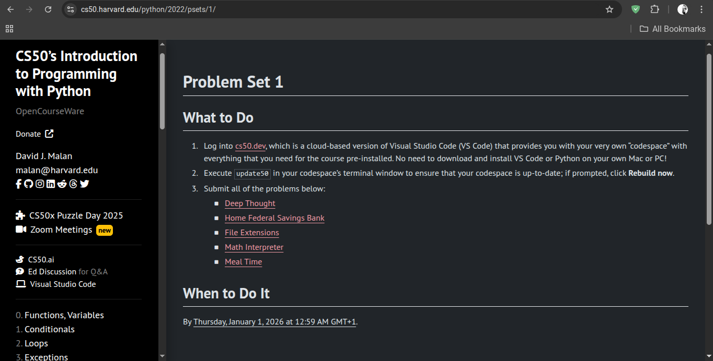

# CONTINUATION OF PSET 1


LINK: [https://cs50.harvard.edu/python/2022/psets/1/](https://cs50.harvard.edu/python/2022/psets/1/)
 
 ---

## Table of Contents
3. [File Extensions](#1-file-extensions)
4. [Math Interpreter](#2-math-interpreter)
5. [Meal Time](#3-meal-time)

---

## 3. File Extensions
link: [https://cs50.harvard.edu/python/2022/psets/1/extensions/](https://cs50.harvard.edu/python/2022/psets/1/extensions/)

In a file called extensions.py, implement a program that prompts the user for the name of a file and then outputs that file’s media type if the file’s name ends, case-insensitively, in any of these suffixes:

 - .gif
 - .jpg
 - .jpeg
 - .png
 - .pdf
 - .txt
 - .zip
 
If the file’s name ends with some other suffix or has no suffix at all, output application/octet-stream instead, which is a common default.

Hints
 - Recall that a str comes with quite a few methods, per [docs.python.org/3/library/stdtypes.html#string-methods](docs.python.org/3/library/stdtypes.html#string-methods).

## 4. Math Interpreter
link: [https://cs50.harvard.edu/python/2022/psets/1/interpreter/](https://cs50.harvard.edu/python/2022/psets/1/interpreter/)

In a file called **interpreter.py**, implement a program that prompts the user for an arithmetic expression and then calculates and outputs the result as a floating-point value formatted to one decimal place. Assume that the user’s input will be formatted as **x y z**, with one space between **x** and **y** and one space between **y** and **z**, wherein:

 - **x** is an integer
 - **y** is +, -, *, or /
 - **z** is an integer
For instance, if the user inputs **1 + 1**, your program should output 2.0. Assume that, if y is /, then z will not be 0.

Note that, just as **python** itself is an interpreter for Python, so will your **interpreter.py** be an interpreter for math!

Hints:
 - Recall that a `str` comes with quite a few methods, per [docs.python.org/3/library/stdtypes.html#string-methods](docs.python.org/3/library/stdtypes.html#string-methods), including split, which separates a `str` into a sequence of values, all of which can be assigned to variables at once. For instance, if expression is a `str` like 1 + 1, then

```py
x, y, z = expression.split(" ")

```
will assign `1` to `x`, `+` to `y`, and `1` to `z`.

## 5. Meal Time
link: [https://cs50.harvard.edu/python/2022/psets/1/meal/](https://cs50.harvard.edu/python/2022/psets/1/meal/)

In **meal.py**, implement a program that prompts the user for a time and outputs whether it’s breakfast time, lunch time, or dinner time. If it’s not time for a meal, don’t output anything at all. Assume that the user’s input will be formatted in 24-hour time as #:## or ##:##. And assume that each meal’s time range is inclusive. For instance, whether it’s 7:00, 7:01, 7:59, or 8:00, or anytime in between, it’s time for breakfast.

Structure your program per the below, wherein **convert** is a function (that can be called by **main**) that converts **time**, a **str** in 24-hour format, to the corresponding number of hours as a **float**. For instance, given a **time** like **"7:30"** (i.e., 7 hours and 30 minutes), **convert** should return **7.5** (i.e., 7.5 hours).

```python
def main():
    ...


def convert(time):
    ...


if __name__ == "__main__":
    main()
```

Hints:
 - Recall that a **str** comes with quite a few methods, per [docs.python.org/3/library/stdtypes.html#string-methods](docs.python.org/3/library/stdtypes.html#string-methods), including **split**, which separates a **str** into a sequence of values, all of which can be assigned to variables at once. For instance, if **time** is a **str** like **"7:30"**, then 
 ```py
 hours, minutes = time.split(":") 
 ```
 will assign "7" to hours and "30" to minutes.

 - Keep in mind that there are 60 minutes in 1 hour.